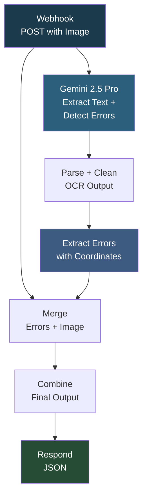

# OCR Detection without Error Image

## Overview

A webhook-based packaging OCR error detection workflow that returns error results as JSON without generating an annotated image. It receives a packaging image via POST webhook, uses Gemini 2.5 Pro to extract all text and detect errors, maps errors to coordinates with color-coded types, and returns the combined error data and original image as a JSON response. The image editing step is available but disabled, making this a faster, data-only version of the OCR detection pipeline.

## How It Works

```
Webhook (POST with image) -> Gemini 2.5 Pro (extract text + detect errors) -> Parse OCR output -> Extract errors with coordinates + colors -> Merge errors with original image base64 -> Combine into final JSON -> Respond to webhook
```

### Workflow Diagram



## Integrations

- **Google Gemini (2.5 Pro)** - Text extraction and error detection

## Setup

1. Import `OCR_detection_without_error_image.json` into your n8n instance.
2. Configure Google Gemini credentials.
3. Activate the workflow. Send POST requests with packaging images to the webhook URL.
